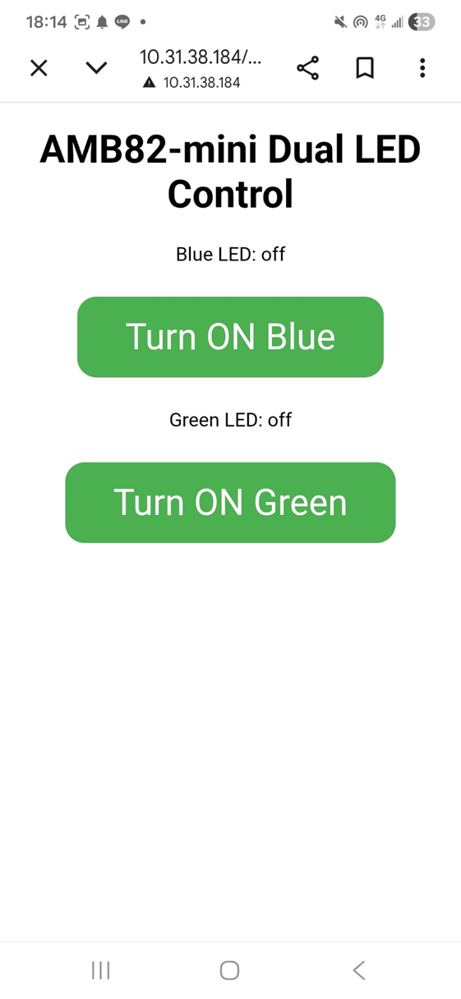
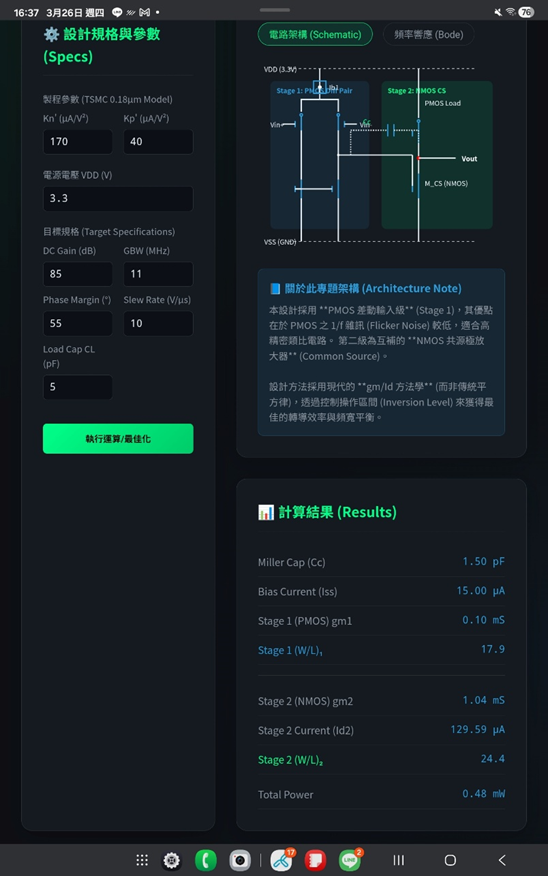
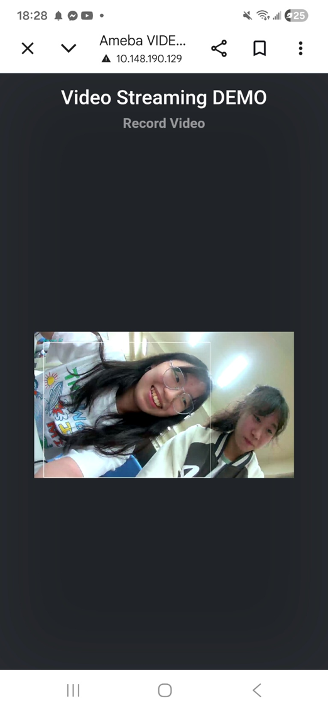
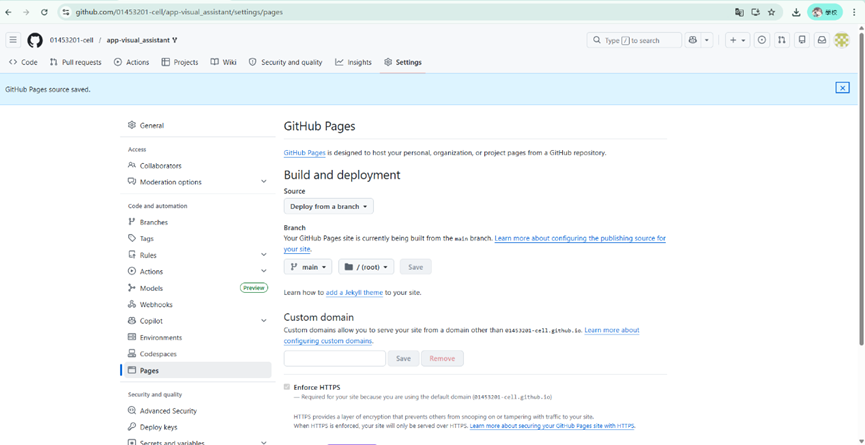
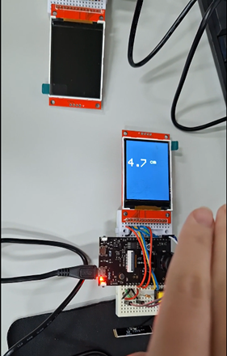
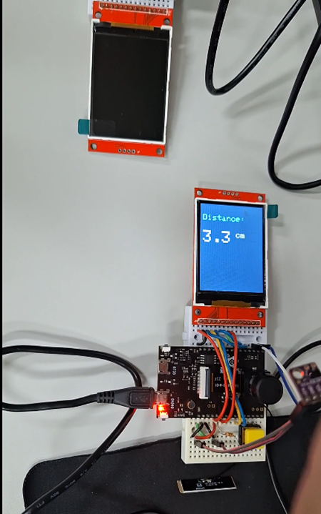
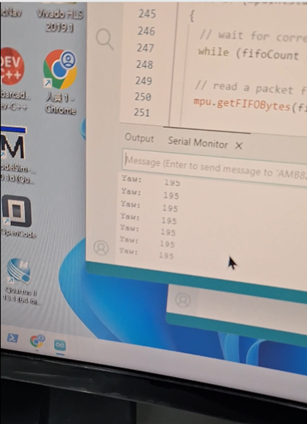
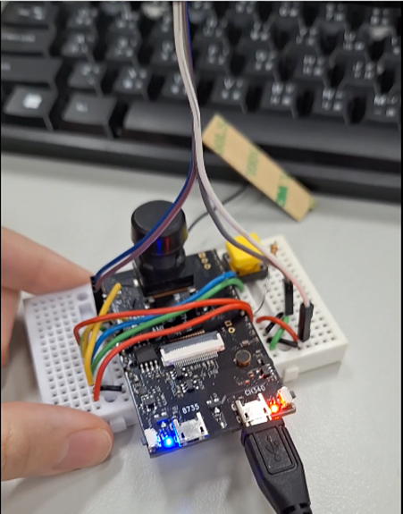
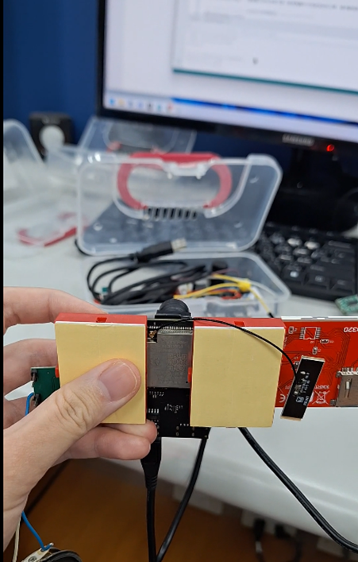

邊緣計算期末心得報告：EdgeAI-MCU 實作與應用
一、 課程各項作業實作說明與成果展示
課堂作業 1：智能體控制硬體裝置設計
•	設計概念：設想一個結合 AI 智能體（Agent）與 MCU 的硬體裝置。
•	硬體組成與應用：
o	設備名稱：[請填寫你當時作業寫的名稱，例如：智慧盲人導航拐杖 / 貓咪智慧餵食器]*
o	硬體架構：AMB82-mini 開發板、影像感測模組、語音輸出模組。
o	核心功能：透過 Edge AI 進行即時環境/物件辨識，並經由大語言模型（LLM）決策，轉化為語音語意，操作硬體裝置提供即時協助。
成果展示： 智慧濾淨呼吸窗
硬體： 室內與室外雙向空氣品質感測模組（偵測
PM2.5、CO2、VOCs） + 窗戶電動推桿機構 + 窗載式微型進氣風機
與 HEPA 濾網 + AI-MCU 執行「微氣候決策代理人」
功能： 在本地端即時交叉比對室內外的空氣品質。當室內 CO2 濃度過
高且室外空氣良好時，自動推開窗戶自然通風；若室外空氣污染嚴重
（如 PM2.5 超標或有油煙味），則立刻關閉窗戶，並啟動內建的過濾
風機，將外氣淨化後引入，確保室內永遠維持鮮氧與潔淨。

課堂作業 2：網頁伺服器控制雙 LED 燈
•	實作原理：基於 WebServer_ControlLED.ino 範例，利用 AI 協助修改代碼。透過建立 HTTP 伺服器，使網頁端能產生兩個互動按鈕，分別發送控制訊號至 AMB82-mini 的 GPIO 引腳，達成無線控制 LED_B 與 LED_G 啟閉的功能。
•	成果展示： 

### 課堂作業 3：Vibe Coding - SD 卡 HTML 網頁託管
*   **實作原理**：利用 Google AI Studio 或 ChatGPT 生成自訂的 HTML App 網頁，並將其儲存於 MicroSD 卡中。AMB82-mini 運行 `READHTMLFile` 範例程式，讀取 SD 卡中的網頁檔案並透過本地 Wi-Fi 進行 Web Hosting，使手機能連上板子並操作該網頁應用。
*   **成果展示**：

     
   
課堂作業 4：YOLOv7 智慧監控與 NTP 時間戳記錄影
•	實作原理：運行 YOLOv7_Survellience 範例，佈署 YOLOv7 輕量化神經網路模型於板載 NPU 上，即時偵測人（person）、自行車（bicycle）、汽車（car）等 6 種物件。結合 WebSocket Viewer 實時串流畫面，並修改 NTPClient 的時間限制（if(hour>=0)），確保全天候觸發偵測時能以「年月時日分秒」格式自動命名並儲存錄影檔案。
•	成果展示：

### 課堂作業 5：盲人專用視覺助理網頁優化
*   **實作原理**：Fork 專案 `app-visual_assistant` 並啟用 GitHub Pages。利用 AI 重新設計 `index.html` 的使用者介面（UI），將原本複雜的畫面簡化為**大按鈕、高對比度、適合盲人語音輔助（Accessibility）觸控**的友善介面，方便視障人士操作視覺 AI 功能。
*   **成果展示**：
   
   
課堂作業 6：I2C 鐳射測距與 SPI TFT 螢幕顯示
•	實作原理：修改 Realtek 內建硬體函式庫中的 VL53L0X.cpp，將預設的 I2C 總線指定為 Wire1（SDA1, SCL1）。在主程式中初始化 Wire1.begin()，透過 I2C 讀取 VL53L0X 紅外線飛行時間（ToF）感測器的距離數據，並經由高速 SPI 總線（時脈 20MHz）將即時距離（cm）更新顯示於 ILI9341 TFT 液晶螢幕上。
•	成果展示： 
 
 
### 課堂作業 7：MPU6050 六軸感測器運動姿態解算（DMP）
*   **實作原理**：使用 `MPU6050_DMP6_GetHeading.ino` 程式，啟用感測器內建的數位運動處理器（DMP，Digital Motion Processor），硬體解算加速度與陀螺儀原始數據，過濾雜訊並精確輸出航向角（Heading Angle / Yaw），實現邊緣端的姿態感測。
*   **成果展示**：
 

    
課堂作業 8：DHT11 溫溼度讀取與 WebServer 遠端監控
•	實作原理：整合 DHT_Tester 與 SimpleHttpWeb 範例。透過 GPIO pin 8 以單總線（One-Wire）協定讀取 DHT11 感測器的溫度與濕度數據。修改 ReceiveData 邏輯，當外部瀏覽器發送 HTTP 請求時，動態將最新的溫濕度數值嵌入 HTML 網頁中回傳。
•	成果展示：

### 課堂作業 9：多媒體 AI 視覺生成與語音合成系統（大作業）
*   **實作核心**：結合 `Camera_2_Lcd_JPEGDEC`（相機擷取與 LCD 解碼顯示）與 `GenAIVisionTTS`（多模態大模型視覺分析與文字轉語音）範例。
*   **選擇實作應用**：[請保留你做的那一個，刪除其他三個]*
    1. AI 輔助回收物分類系統
    2. AI 輔助英語讀字卡造句
    3. AI 看圖說故事
    4. AI 情緒感知音樂播放器
*   **技術流程**：鏡頭拍照 -> 透過網路將影像傳輸至雲端/邊緣 LLM 多模態模型推論 -> 根據 Prompt 傳回分析文字 -> MCU 透過 TTS (Text-to-Speech) 模組將文字轉語音播放，同時於 LCD 螢幕顯示成果。
*   **成果展示**：
     
二、 EdgeAI MCU 之可能應用設計 (以 AMB82-mini 為例)
基於本學期對 AMB82-mini 的學習，本報告提出一項具備實用價值的 Edge AI 應用設計：
應用名稱：智慧長者居家跌倒與環境安全偵測系統
•	應用場景：佈署於獨居長者或育嬰房之天花板角落。
•	硬體架構設計：
o	主控核心：AMB82-mini（利用其強大的 NPU 算力與 H.264 影像處理能力）。
o	感測周邊：板載相機模組、VL53L0X 紅外線測距（輔助高度變化偵測）、DHT11（環境溫溼度監控）。
•	AI 協助功能與模型：
1.	邊緣端人體姿態估測 (Pose Estimation)：在板端 NPU 運行輕量化 Pose 辨識模型，當偵測到人體骨架突發性由高處降至地面且長時間未移動，即判定為「跌倒」。
2.	多模態 AI 複檢與語音關懷：觸發跌倒警報後，AMB82-mini 擷取當前影像，透過 API 傳送給視覺大模型（如 Gemini Vision）進行二次確認，同時利用 TTS 功能播放：「請問您還好嗎？需要幫忙嗎？」。
3.	即時警報與遠端串流：若長者無回應，系統立刻透過 Wi-Fi 發送緊急 Line Notify 通知給家屬，並開啟 RTSP 串流供家屬即時查看現場狀況。
•	設計優勢：影像在邊緣端（板子）進行第一線隱私去識別化處理，只有在危急時才建立雲端聯網，兼顧隱私、低延遲與高精準度。

三、 學習心得
本學期在邊緣計算（Edge Computing）課程中獲益匪淺。從一開始基本的 GPIO 控制、I2C 與 SPI 週邊通訊協定（如實作 VL53L0X 測距與 TFT 螢幕顯示），到中後期深入體驗 Edge AI 的強大，例如在 AMB82-mini 這塊微型開發板上直接運行 YOLOv7 物件偵測。
最令我印象深刻的是課程導入了 Vibe Coding 與 AI 協作（ChatGPT / Gemini） 的觀念。在面對複雜的硬體暫存器修改（如作業六修改庫檔案指定 Wire1）或是編寫前端控制網頁（作業三、作業五）時，AI 成為了極佳的助教，大大降低了硬體工程師跨足軟體開發與演算法佈署的門檻。
這門課讓我明白，未來的嵌入式系統不再只是盲目地將數據上傳雲端，而是要在運算資源有限的 MCU 邊緣端，優化並運行具備智慧的 AI 模型，實現低延遲、高隱私且節能的智能裝置。這對我未來在物聯網與 AIoT 領域的專案開發奠定了非常紮實的基礎。

